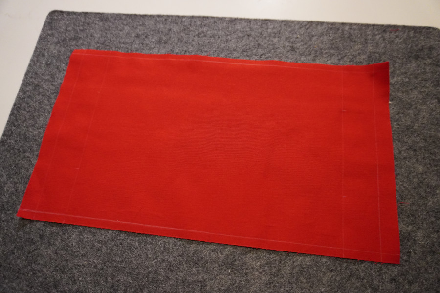
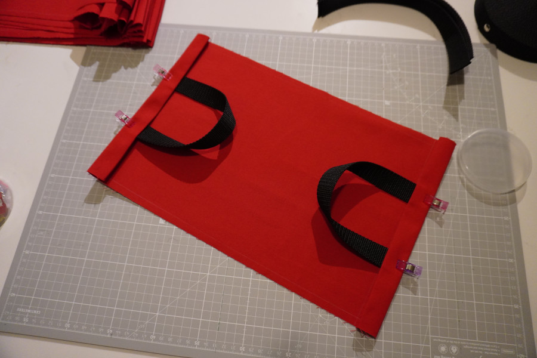
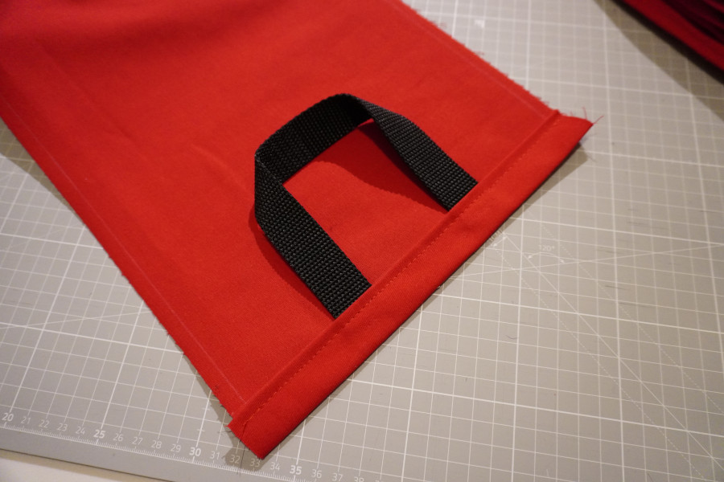
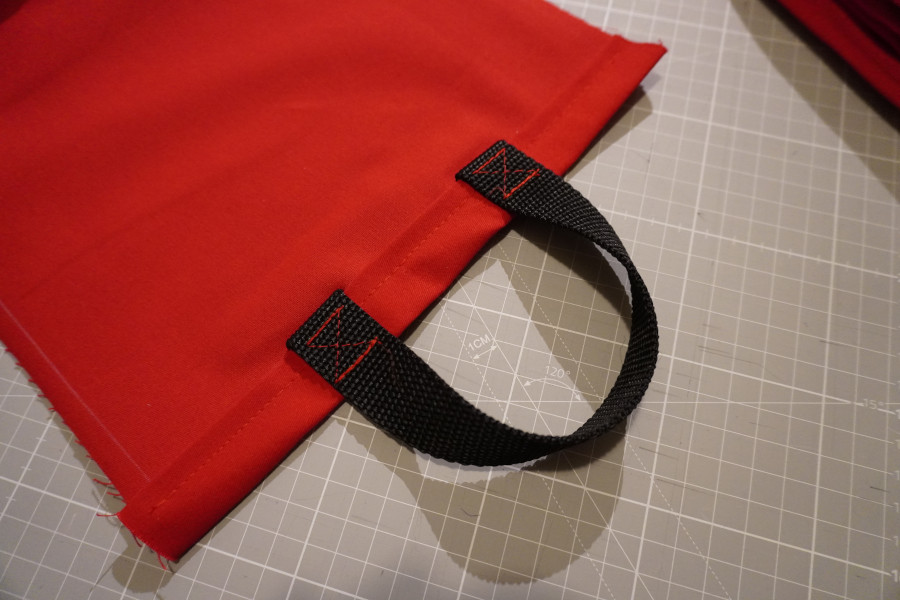
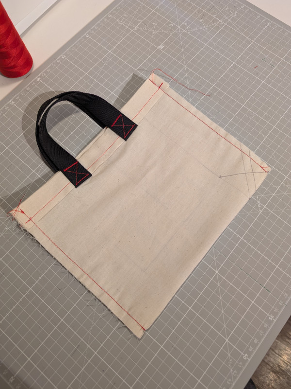
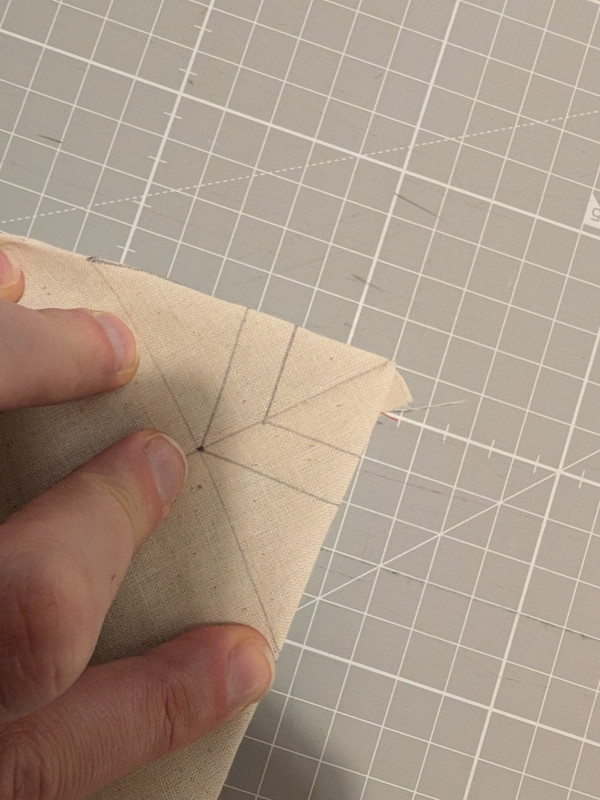
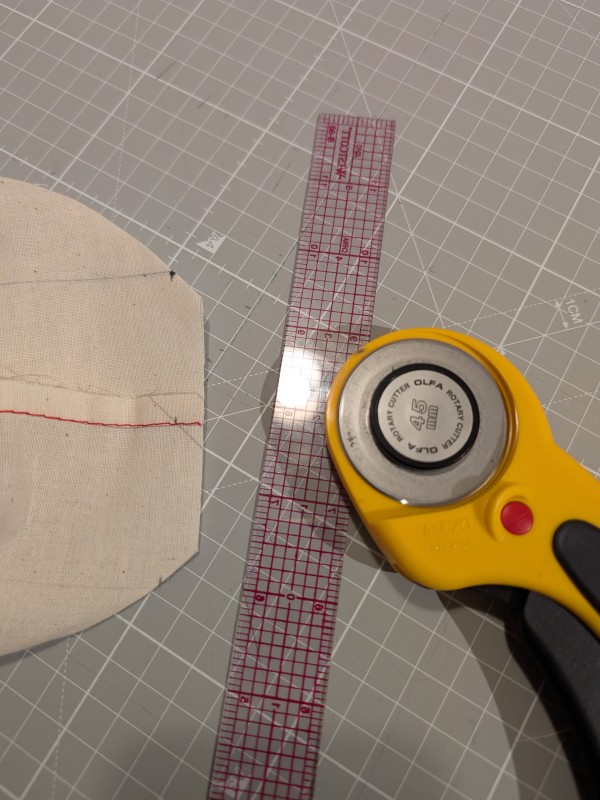
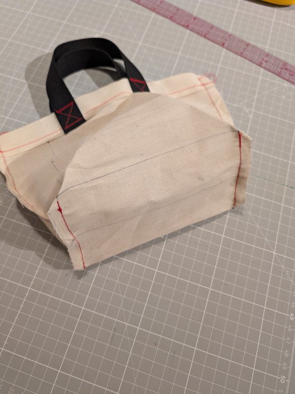
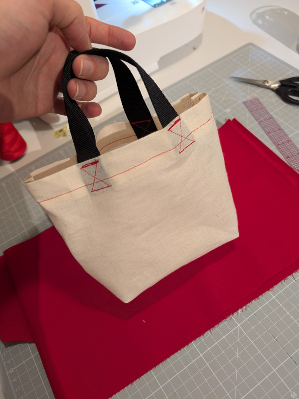

# Mini Tote Bag

  

## Materials
The selected main fabric is from Joann, other items can come from anywhere. For convenience, I linked to products available at Joann in the Crossroads Mall.

| **Item**                                       | **Notes**                                                                                                                   |
|------------------------------------------------|---------------------------------------------------------------------------------------------------------------------------|
| [Red Rodeo Cotton Sportswear Fabric](https://www.joann.com/p/red-rodeo-cotton-sportswear-fabric/19160985.html)             | Fabric ID 1916-0985. Can be substituted with any thick fabric with low stretch that doesn't fry much. |
| [Pellon 884 Cut A Way Stabilizer 20"](https://www.joann.com/p/pellon-884-cut-a-way-stabilizer-20in/15653983.html)            | Can be substituted with any midweight cutaway stabilizer (20-inch or wider). This is a basic consumable for embroidery. |
| [1-inch Polypropylene Belting (Joann)](https://www.joann.com/p/1in-sold-by-the-yard-black-polypropylene-belting-by-fabany/19867712.html) or [TECEUM Webbing (Amazon)](https://www.amazon.com/TECEUM-Inch-Webbing-Climbing-Outdoors/dp/B0BQ8WJN4G) | Any black 1-inch webbing will do. Expensive at Joann's.  |
| [Coats & Clark 1100yd Mini King Multicolor 40wt Polyester Thread](https://www.joann.com/p/coats-andamp-clark-poly-mini-king-spools-1100yds/7180060.html) | Any white, embroidery, polyester, 40wt (40 weight) thread will do. Embroidery top thread.                                   |
| [Gutermann 2735yd Toldi 40wt Overlock Thread (White)](https://www.joann.com/p/gutermann-2735yd-toldi-40wt-overlock-thread/1454578.html) | Any basic white, 40wt thread will do. Embroidery bottom thread.                                                            |
| [Gutermann 2735yd Toldi 40wt Overlock Thread (Red)](https://www.joann.com/p/gutermann-2735yd-toldi-40wt-overlock-thread/1548288.html) | Any basic red, 40wt thread will do.                                                                                        |

## Assembly

Cut a 10 × 18 5/8-inch square from your fabric.
Mark the seams and folds on the left side as follows:

  

The marked fabric should resemble this:

  

Fold the short sides twice:
* First fold: 3/8 inch in (so the folded edge aligns with the first line).
* Second fold: 1 inch in (so the fold aligns with the second line).

Press each fold with hot iron.

Prepare 2 12-inch pieces of webbing.
Insert the ends of the webbing under the 1-inch fold, ensuring they touch the inner crease (1-inch deep).
Make sure that the handles are not twised.
Secure the handles with magic clips or regular pins.

  

Sew along the edges, maintaining 6/8-inch depth.
Remember to backstitch and both ends.

  

Fold the handles overr.
Then sew a box pattern over each piece ofthe webbing for reinforcement: start at the edge along the fold, then forward-back-forward, rotate the fabric to the diagonal (keep the needle down and push the feet lever up), sew through the diagonal, rotate again, forward-back-forward, rotate, sew over the diagonal, then rotate and sew forward over existing stitches to lock the thread.

  

Embroider the right side now if desired.

To continue assembly, fold the right sides together.
Sew along the sides maintaining 3/8-inch depth.
(Remember about backstitching!)

  

This makes a functional yet flat bag.
If you wish to stop here, just turn the bag outside in.

To add volume to the bag, you'll have to cut away the corners.
Do one corner at a time:
* Fold each corner so the seam aligns diagonally at a 45° angle.
    
* Use a quilting ruler to mark a line perpendicular to the seam, 3 1/4 inches wide (1 3/4 inches on each side).
* Move the ruler back 3/8 inch to add seam allowance and cut along this new line.

  

Sew along the marked seam lines for each corner.
This gives the bag its shape.

  

Turn the bag right-side out, and it’s ready to use!

  

